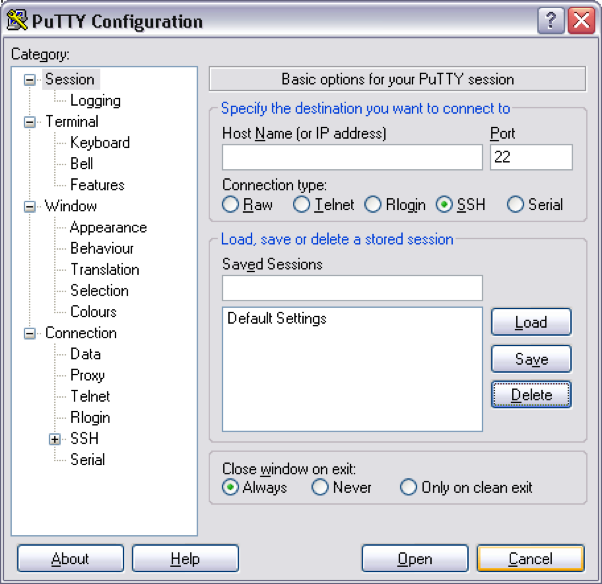
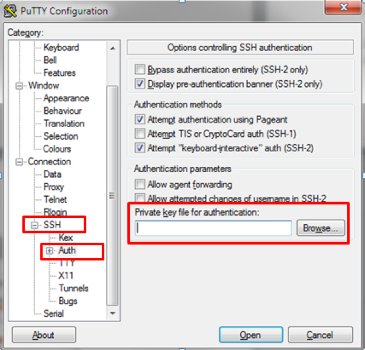

# Lab Setup 

Access the [GitHub repository](https://github.com/jruels/devsecops)
Download the code by clicking the green `Code` button and selecting "Download ZIP"
Extract the zip file and use the keys directory for the following steps. 

## MacOS 
Use the `lab.pem` from the downloaded `keys` directory

### Set permission on SSH key 
```
chmod 600 /path/to/lab.pem
```

### SSH to lab servers 
The username for SSH is `ubuntu`
```
ssh -i /path/to/lab.pem ubuntu@<LAB IP> 
```


## Windows 
The username for SSH is `ubuntu`

Use the `lab.ppk` from downloaded `keys` directory

Open Putty and configure a new session. 
  


Expand “Connection_SSH_Auth and then specify the PPK file 


 Now save your session    


